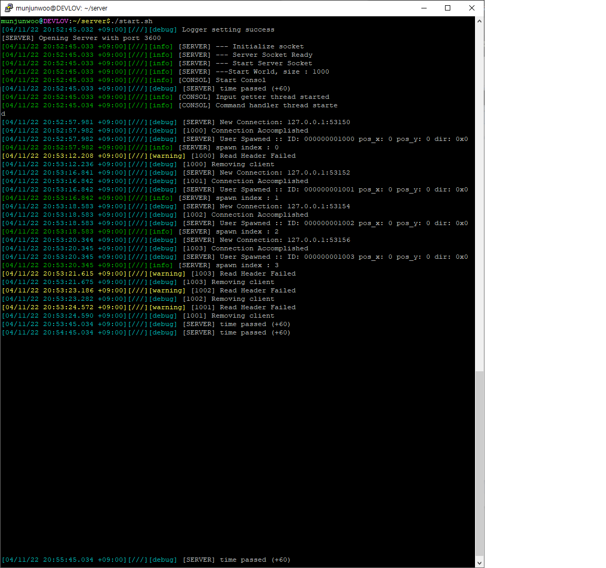
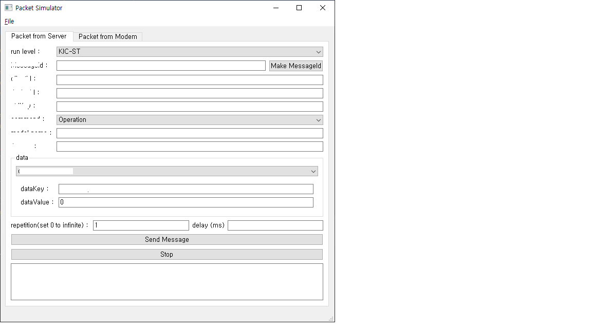
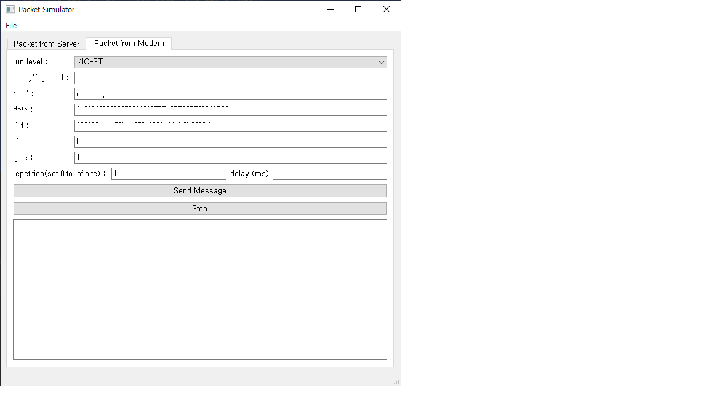
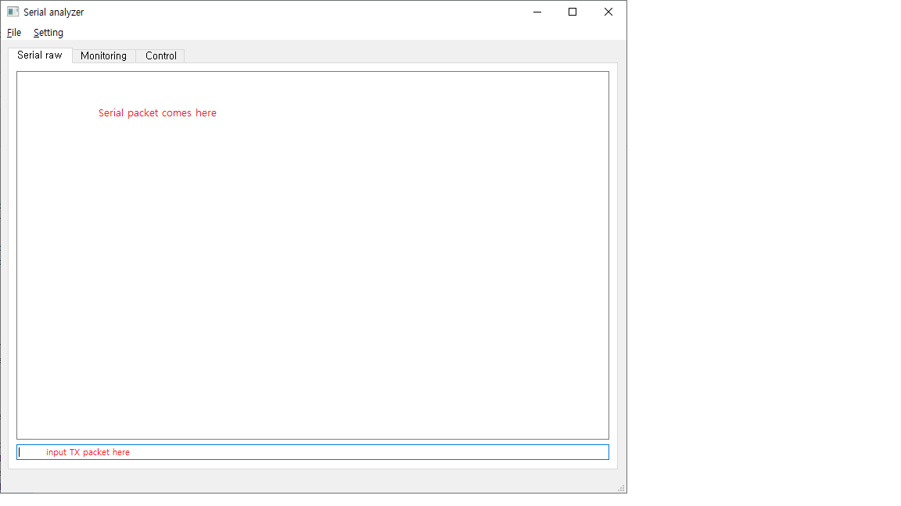
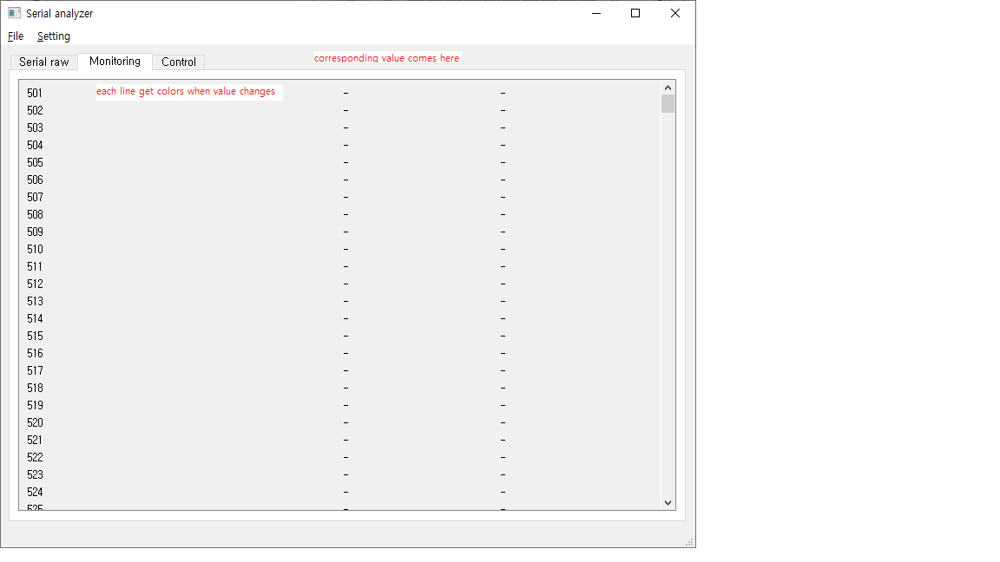
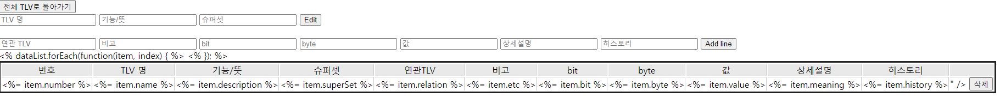
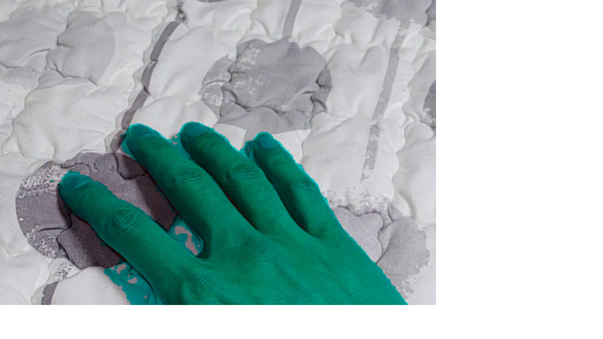

# Portfolio
Projects I've made

## C++ Server
1. Project info
  - Description : 
    - socket server templete
    - designed for game server
    - Template code, not fully implemented details
  - language : C++
  - used tech : socket programming, cmake
  - period : 21/01 ~ 21/06
  - url : https://github.com/AswinBlue/CppServer

2. What it does
  1) socket communication
    - server open socket and listening to client connection
    - server can handle connection and disconnection of client, and manage connected clients
    - parse client message and handle client requests


   2) logging system
    - log with 'spdlog' library
    - can set log level
   3) Database
    - can connect mysql DB with 'mysqlx' library


## Android RPA
1. Project Info
  - Description :
    - scan and manipulate android app with python
    - template code, for app testing
  - language : python
  - used tech : opencv
  - period : 21/03
  - url : https://github.com/AswinBlue/python_android_rpa

2. What it does
  1) scan screen and save image as file
  2) compare image file and detect changes
  3) imitate screen touch as code
  4) read text from image with 'tesseract' library


## PyQT http packet simulator
1. Project Info
  - Description :
    - window GUI program with 'PyQT' library
    - used to validate server logic
  - language : python
  - used tech : PyQT
  - period : 20/03 ~ 20/09
  - url : (private)

2. What it does
  1) send jason data to server and get response
  2) can repeat sending data with given delay
  3) can save request and response as text file with time stamp




# PyQT serial viewer
1. Project Info
  - Description :
    - window GUI program with 'PyQT' library
    - used to debug serial communication
  - language : python
  - used tech : PyQT
  - period : 20/09 ~ 20/12
  - url : (private)

2. What it does
  1) can see serial packet from window 'COM' port
  2) can record input packet with time stamp
  3) can send serial packet to 'COM' port

  4) monitor serial packet, and show parsed data as table
  5) color changed value for visibility




## Nodejs Server
1. Project Info
  - Description :
    - web server for showing and parsing protocol
    - needed simple web server for development reference
  - language : javasctipt
  - used tech : nodejs, mysql
  - period : 21/07 ~ 20/12
  - url : (private)

2. What it does
<details>
    <summary>directory tree</summary>
  
  ```
  # directory tree
  │  main.js
  │  package.json
  │  tree.txt
  │  
  ├─config
  │      db_config.json
  │          
  ├─route
  │      default.js
  │      edit.js
  │      history.js
  │      login.js
  │      parse.js
  │      
  ├─static
  │      edit_func.js
  │      index_func.js
  │      parse_func.js
  │      tlv.js
  │      
  └─views
          edit.html
          history.html
          index.html
          login.html
          parse.html
  ```
</details>
  
  1) route http request and show pages  
    - 'main.js', '/route/*'
<details>
    <summary>main.js</summary>
  
    ```
    // main.js
    var express = require('express');
    var session = require('express-session');
    var bodyParser = require('body-parser');
    var app = express();

    // static files
    app.use('/static', express.static(__dirname + '/static'));
    console.log('static path ' + __dirname + '/static' + ' as \'/static\'');

    // session
    app.use(session({
        secret:"AIRSOLUTION",
        resave:false,
        saveUninitialized:true
    }));
    console.log('use session');

    // body-parser
    app.use(bodyParser.urlencoded({extended: false}));

    app.use('/script', express.static('script'));

    // routing
    r_history = require('./route/history.js');
    app.use('/history', r_history);
    r_parse = require('./route/parse.js');
    app.use('/parse', r_parse);
    r_edit = require('./route/edit.js');
    app.use('/edit', r_edit);
    r_login = require('./route/login.js');
    app.use('/login', r_login);

    // root routing은 항상 제일 뒤로 빼준다
    r_default = require('./route/default.js');
    app.use('/', r_default);


    // ejs setting
    app.set('views', './views');
    app.set('view engine', 'html');
    app.engine('.html', require('ejs').renderFile);

    // open server
    var server = app.listen(80, function() {
        var host = server.address().address
        var port = server.address().port
        console.log("App listening at http://%s:%s", host, port)
    });

    console.log('Server Start');
    ```
</details>

  3) read database and show protocol data as table  
    - '/config' for DB connection 
    - use 'mysql' module to connect local mysql DB
<details>
  <summary> db loading </summary>
  
  ```
  router.get('/', function(req, res, next) {
	// load DB
	var mysql = require('mysql');
	var db_config = require('../config/db_config.json');

	var connection = mysql.createConnection({
	    host : db_config.host,
	    user : db_config.user,
	    password : db_config.password,
	    database : db_config.database
	});

	// DB query
	connection.connect();
	connection.query('SELECT * FROM tlvMap RIGHT JOIN tlv ON tlv.number = tlvMap.number ORDER BY tlv.number, (tlvMap.bit)*1, (tlvMap.byte)*1, (tlvMap.value)*1', function (error, results, fields) {
	    if (error) {
	        console.log(error);
			res.status(500).json({"Error": error});
	    }
        else {
            // add dummy
            results.push({"number":""});
        	// link html file
            res.render('index.html', {dataList: results});
        }
	  });
	  connection.end();
  });
  ```
</details>

  4) can edit database in browser  
  
  5) authenticate with login data in DB 

<details>
  <summary> db login </summary>
  
  ```
  function authenticate(req, res, next) {
    // load DB
    var mysql = require('mysql');
    var db_config = require('../config/db_config.json');

    var connection = mysql.createConnection({
        host : db_config.host,
        user : db_config.user,
        password : db_config.password,
        database : "mysql"
    });

    // DB query
    connection.connect();
      var id = req.body.user;
      var pswd = req.body.pswd;
    connection.query("SELECT * FROM user WHERE User=? AND authentication_string=PASSWORD(?)", [id, pswd], function (error, results, fields) {
          console.log("id : %s, password : %s", id, pswd);
          console.log("result : %s", results);
        if (error) {
            console.log(error);
        res.status(500).json({"Error": "DB error"});
        }
          else if (results.length <= 0) {
              res.send("Login Failed");
          }
          else {
              // redirect to 'edit'
              req.session.user = results[0].User;
              req.session.save(function() {
                  res.redirect('/edit/' + req.params.TLV);
                  console.log('redirect to /edit/' + req.params.TLV);
              });
          }
    });
    connection.end();
  };
  ```
</details>
  
  7) parse hex data with protocol and show result  
    - divide hex string by bytes and show what each bytes mean

## Diary
  

## OpenCV face color changer
1. Project Info
  - Description :
    - detect area where color is similar to skin, and change its color
    - for UCC project
  - language : python
  - used tech : opencv
  - period : 19/01 ~ 19/01
  - url : https://github.com/AswinBlue/opencv_face_color_change

2. What it does
  1) open video and show the video  
  2) detect skin color from video and change it into other color  
  3) can puase and continue video  
  4) can select ROI when video puased  
  5) save it to mp4 file  
    
